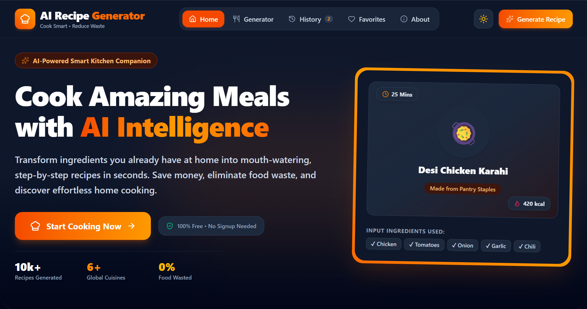
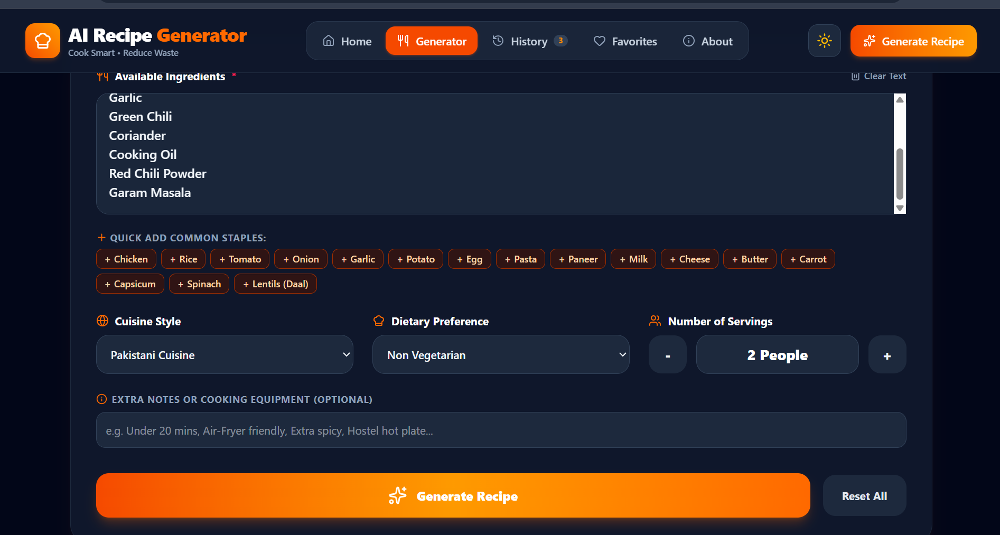
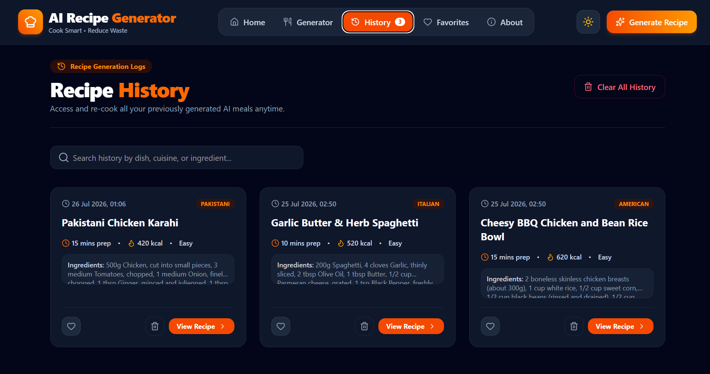
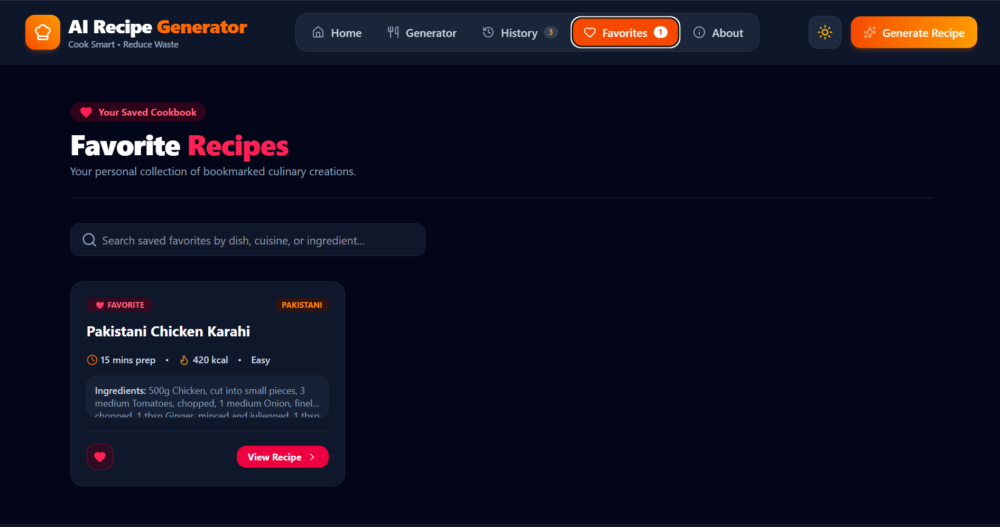
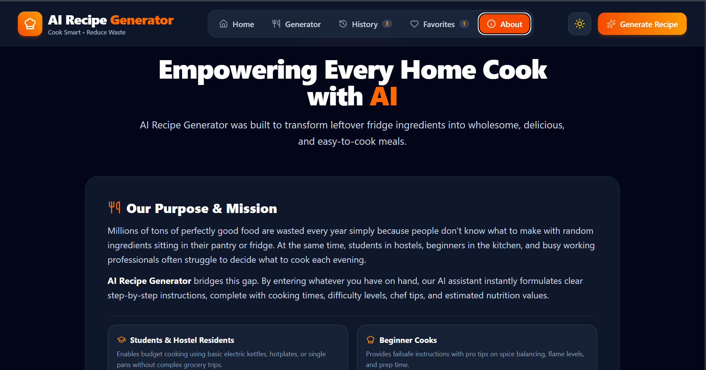

# 🍳 AI Recipe Generator

## 📌 Project Overview

AI Recipe Generator is a web application that helps users create delicious recipes using the ingredients they already have at home.

The application reduces food waste and helps students, hostel residents, busy professionals, and families decide what to cook quickly.

---

## 🚀 Live Demo

https://your-project-name.vercel.app

---

## ✨ Features

- AI-powered recipe generation
- Enter available ingredients
- Select cuisine
- Select dietary preference
- Recipe preparation time
- Cooking time
- Step-by-step cooking instructions
- Nutrition information
- Favorite recipes
- Recipe history
- Responsive design
- Beautiful modern interface

---
## 🤖 AI Feature

The application uses Google's Gemini AI model to generate recipes.

The AI receives:

- Ingredients
- Cuisine
- Dietary preference

It generates:

- Recipe name
- Ingredients
- Instructions
- Preparation time
- Cooking time
- Calories
- Nutrition
- Cooking tips

---
## 🤖 AI Instructions / System Prompt

The AI Recipe Generator uses Google's Gemini AI model with the following instructions:

**System Prompt:**

```
You are an expert chef and nutrition assistant.

Your task is to generate a complete recipe based only on the ingredients provided by the user.

For every recipe:
- Create a suitable recipe title.
- List all required ingredients.
- Provide clear step-by-step cooking instructions.
- Estimate preparation time.
- Estimate cooking time.
- Include nutritional information such as calories.
- Suggest useful cooking tips.
- Recommend serving suggestions when appropriate.
- Format the response in a clean, easy-to-read structure.
```

The AI generates personalized recipes based on the user's ingredients, preferred cuisine, and dietary preferences.


## 🛠 Technologies Used

- React
- TypeScript
- Vite
- Google Gemini API
- HTML
- CSS
- JavaScript

---

## 📷 Screenshots

### Home Page



### Recipe Generator



### History



### Favorites



### About


---
## 📋 Prerequisites

- Node.js (v18 or later)
- npm
- Google Gemini API Key
---
## 🔑 Environment Variables

Create a `.env` file in the project root and add:

```env
GEMINI_API_KEY=your_api_key_here
```
## 🎯 Problem Statement

Many people have ingredients available at home but don't know what to cook. This often leads to wasted food and extra time searching for recipes.

AI Recipe Generator solves this problem by creating personalized recipes based on the user's available ingredients, preferred cuisine, and dietary preferences.
## ⚙️ Installation

Clone the repository

```bash
git clone https://github.com/aysh8536@gmail.com/AI-Recipe-Generator.git
```

Install dependencies

```bash
npm install
```

Start the project

```bash
npm run dev
```

---

## 👩‍💻 Author

Ayesha Jamil

BS Computer Science

University of Education
# AI-Recipe-Generator
An AI-powered recipe generator that creates personalised recipes from available ingredients using Google Gemini AI.
